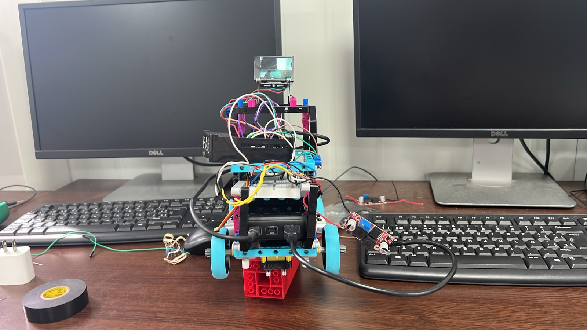
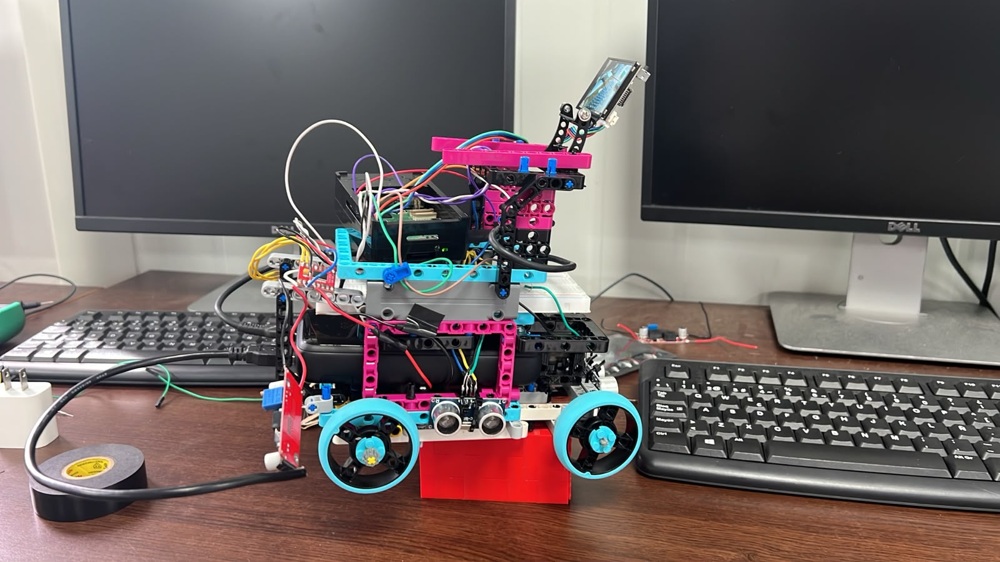
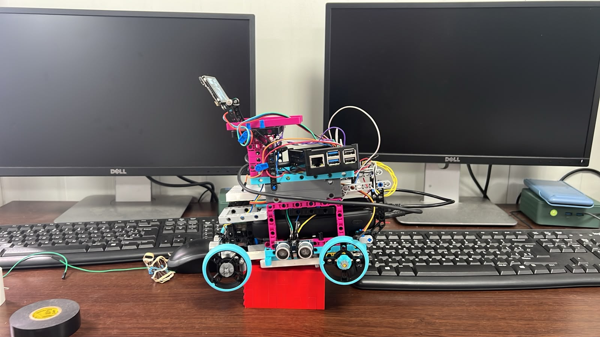
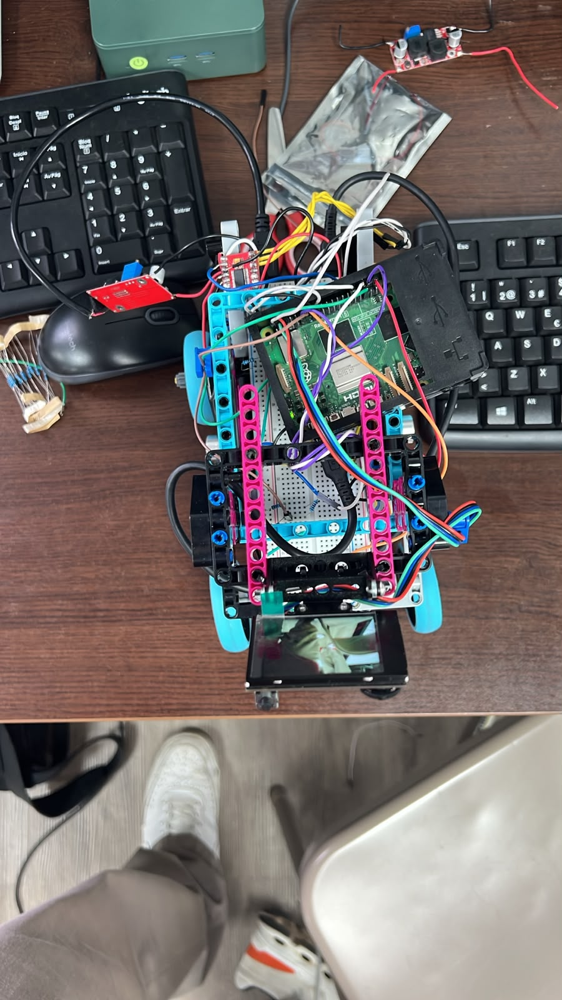
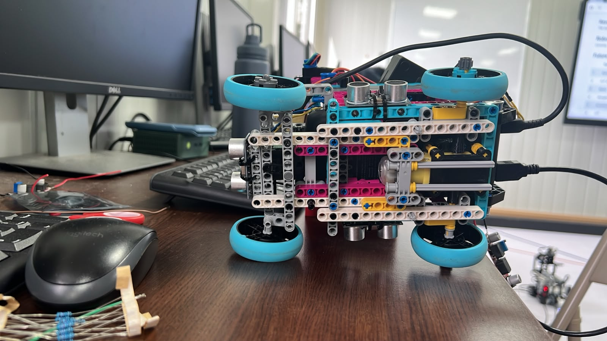
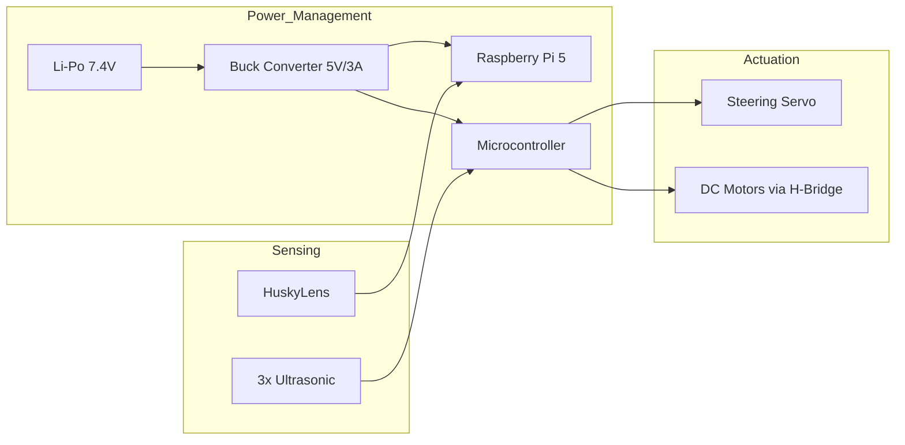
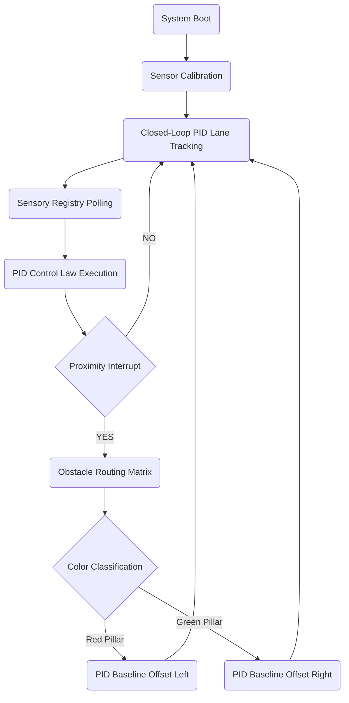

# WRO2026-PiolinTech

<p align="center">
Documentation for team PiolinTech's robot for WRO 2026 - Future Engineers
</p>

<p align="center">

</p>

<p align="center">
  <a href="https://instagram.com/piolintech">
    
  </a>
  <a href="https://youtube.com/@piolintech">
    
  </a>
</p>

Welcome to the official repository for Piolín, our autonomous robotic vehicle designed and built for the World Robot Olympiad (WRO) Future Engineers competition. This repository contains the complete mechanical designs, electrical schematics, firmware files, and computer vision algorithms developed by our team. **Piolín** is an advanced autonomous robotic vehicle engineered to compete in the **WRO Future Engineers 2026** category. Running on a high-performance **Raspberry Pi 5** processing core, the robot handles real-time edge computer vision via a **Huskylens** smart camera for strict lane alignment. It fuses visual telemetry with an array of **three ultrasonic distance sensors** to navigate complex track curves, identify lane markers, and safely execute dynamic obstacle evasion.

---

## General Index

* **[Get to know us](./t-gtku)**: Meet the team, our story, and our specific roles in development.
* **[Piolin Overall](./v-photos)**: Orthogonal and perspective photography of the physical vehicle.
* **[Our Robot on Action](./Video)**: Video logs and live track test runs.
* **[Important Documents](./docs)**:
* **[Outside of Piolin](./docs/hardware)**: Hardware design, chassis specs, and mechanical calculations.
* **[Inside of Piolin](./docs/software)**: Software logic, libraries, and communication protocols.

* **[Our Programming](./code)**:
* **[R1](./code/Round1)**: Source code and calibration files used in Round 1.
* **[R2](./code/Round2)**: Optimized logic and sensor adjustments utilized in Round 2.

* **[Our Evolution](./models)**: Detailed progression of our physical designs and prototypes.
* **[Technical Details](./schemes)**: Circuit schematics, power distribution maps, and wiring.
* **[Flowcharts and Important Resources](./embed)**: Core logic, state machines, and state diagrams.

---

### Team Members

| Member | Information | Contact |
| :---: | :--- | :---: |
|  | **Sebastián Martínez**<br>Colegio Bilingüe de Panamá | [📸 Instagram](https://www.instagram.com/sebastian.mvrl/) |
|  | **Mia Cantoral**<br>Colegio Bilingüe de Panamá | [📸 Instagram](https://www.instagram.com/miaacnt) |
|  | **Christian Castrellón**<br>Colegio Bilingüe de Panamá | [📸 Instagram](https://www.instagram.com/cj.chriss) |
| **Coach** | **Hanna Figueroa**<br>Thank you teacher Hanna for being our brightest and biggest inspiration out there. We truly admire and love you! :) | |

---

## Goal & Structure

### Our Vision

Our primary objective is to develop an elegant, highly reproducible autonomous vehicle capable of completing both the Open Challenge and the Obstacle Challenge with maximum speed and reliability. By using a hybrid setup, combining the raw mechanical flexibility of the LEGO/SPIKE ecosystem with custom DC motors, microcontrollers, and a Raspberry Pi 5, we bridge the gap between educational building platforms and advanced industrial robotics.

### Team Goals 

* **Maintain Trajectory Precision**: Achieve zero lateral sliding during turns by refining our physical Ackermann implementation and steering PID loops.
* **Zero-Latency Obstacle Detection**: Maximize edge processing speeds with the Raspberry Pi 5 and HuskyLens 2, keeping detection loop latency below 15ms.
* **Mechanical Modularity**: Ensure that any structural, sensor, or cabling component can be swapped out in under 2 minutes during pit lane runs.
* **Flawless Execution at Nationals**: Deliver consistent, collision-free runs under varying light conditions and surface frictions.

---

## Dimension Table

The following table outlines the key physical and mechanical dimensions of Piolín, strictly adhering to the WRO Future Engineers regulations:

| Technical Parameter | Specification Value | Engineering Notes / WRO Rules |
| --- | --- | --- |
| **Total Length** | 170 mm | Well within the maximum 250 mm limit. |
| **Total Width** | 140 mm | Calculated track width edge to edge of tires. |
| **Total Height** | 120 mm | Lowered center of gravity profile. |
| **Wheelbase ($L$)** | 165 mm | Measured pivot to pivot distance for Ackermann calculations. |
| **Track Width ($W$)** | 140 mm | Center to center lateral tire spacing. |
| **Rear Tires (Propulsion)** | 56.18 mm (Diameter) | High-grip LEGO SPIKE Blue rubber wheels. |
| **Front Tires (Steering)** | 42.8 mm (Diameter) | Low-friction guide wheels for effortless steering pivot. |
| **Total Vehicle Mass** | 721.41 g | Mass optimized to reduce momentum during sudden turns. |

---

## Feature Table

Our hardware selection is strategically divided to separate real-time sensory-actuator tasks from heavy mathematical processing:

| System | Component | Primary Feature / Technical Specification |
| --- | --- | --- |
| **High-Level Processor** | **Raspberry Pi 5** | 2.4 GHz Quad-Core ARM Cortex-A76. Runs camera image parsing, PID calculations, and state machines. |
| **Low-Level Microcontroller** | **Arduino Nano** | ATmega328P. Handles instant hardware PWM generation for steering and millisecond sensor interrupts. |
| **Computer Vision Engine** | **HuskyLens 2** | AI-driven camera connected via hardware I2C; localizes color pillars on the fly. |
| **Distance Telemetry** | **HC-SR04 (x3)** | Active ultrasonic transducers angled at 30 degrees to sense diagonal walls predicted ahead. |
| **Propulsion Power** | **Metal-Geared DC Motors** | High-RPM micro motors providing rapid acceleration out of tight turns. |
| **Steering Precision** | **Micro Metal Servo** | Digital high-torque feedback actuator driving the steering rack without backlash. |
| **Power Protection** | **Voltage Dividers** | 1 kOhm and 2 kOhm resistor pairs stepping Echo signals down from 5V to a safe 3.3V. |

---

## Structural Evolution (v1, v2, & v3)

The mechanical architecture of our robot transitioned through three distinct phases to resolve physical weaknesses under live track conditions:

1. **Version 1 (Phase 1.0 - LEGO Technic Base)**:
The early model relied entirely on a standard LEGO Technic chassis driven by the LEGO Mindstorms EV3 Intelligent Brick. The primary limitation was structural play; the flexible nature of plastic snap-pin connectors allowed significant chassis twist under high steering torque, leading to physical track drift. Additionally, the EV3 processor suffered from severe loop latency and thread jitter when trying to parse ultrasonic data and color readings concurrently.
2. **Version 2 (Phase 1.5 - SPIKE Box Braced)**:
To address chassis flex, the frame was rebuilt using cross-braced white and grey LEGO SPIKE Prime beams, forming a rigid overhead bridge. While this successfully eliminated the vertical chassis twist, the system still suffered from electrical contact dropouts. Standard RJ12 telephone-style cables vibrated loose inside the EV3 ports during track runs, requiring manual tape reinforcement on critical telemetry lines to prevent software freezes.
3. **Version 3 (Current Hybrid Configuration)**:
The current active configuration implements a hybrid structural paradigm. We preserved the rigid SPIKE Prime box-frame structure for compliance and modularity, but replaced the heavy EV3 brick and LEGO motors with a Raspberry Pi 5, an Arduino Nano, and micro metal-geared DC motors. By soldering standard pin connectors and mounting the side ultrasonic sensors at a 30-degree forward-facing angle, we achieved stable telemetry, predictive wall sensing, and a lower overall center of gravity.

---

## Logic (Flowchart Logic)

### Multi-Threaded Software Architecture

The control software relies on a deterministic execution flow designed to prevent sensor polling delays from lagging our physical actuation. Thread 1 constantly queries the three HC-SR04 sensors and the HuskyLens 2 camera over I2C to write raw telemetry to a shared memory block. Thread 2 reads these clean values at a constant execution speed of 100 Hz to update the steering and propulsion states.


```
             [System Boot & Initialization]
                           │
                           ▼
                [Read Sensor Telemetry]
         (3x Ultrasonic Distances & Camera I2C)
                           │
          ┌────────────────┴────────────────┐
          ▼                                 ▼
 [Obstacle Detected?]             [Clear Path / Wall Following]
   (Center < 25 cm)                       (Center >= 25 cm)
          │                                 │
          ▼                                 ▼


[Query Huskylens Camera]            [Run PD Control Loop]
(Check Pillar: Red vs. Green)      Error = Dist_Left - Dist_Right
│                        Output = Kp * e + Kd * (de/dt)
▼                                 │
[Inject Steering Shift Angle]                  ▼
(Execute Dodge Maneuver)         [Adjust Servo Direction]

```

### Proportional-Derivative (PD) Control Loop

When navigating clear stretches of the track, the vehicle maintains central lane positioning using a PD wall-following algorithm. The system continuously evaluates the difference between the left and right ultrasonic distance sweeps to compute an instantaneous corrective error:

$$e(t) = \text{Dist}_{\text{left}} - \text{Dist}_{\text{right}}$$

The error is processed by our steering loop to determine the target angle for the servo:

$$u(t) = K_p \cdot e(t) + K_d \cdot \frac{de(t)}{dt}$$

Where $K_p$ represents our proportional gain (correcting current drift) and $K_d$ represents our derivative gain (counteracting the rate of drift to prevent overshooting at the exit of turns).

### Obstacle Challenge Decision Logic

When the center-facing ultrasonic sensor reports a distance below 25cm, a software override suspends the PD wall-following routine. The control system queries the HuskyLens 2 color-signature block:

* **Red Pillar Identified**: The robot shifts its target trajectory offset to the right of the obstacle.
* **Green Pillar Identified**: The robot shifts its target trajectory offset to the left of the obstacle.
* **No Active Pillar Identified**: The robot defaults to ultrasonic braking to prevent high-speed collisions.

---

## Media & Resources

### Vehicle Photos

Physical reference orthogonal views are located in the [Vehicle Images](./v-photos) directory:

**PARTIALLY LEGO**
| Front View | Back View | Left View |
| :---: | :---: | :---: |
|  |  |  |
| **Right View** | **Top View** | **Bottom View** |
|  |  |  |

**COMPLETE LEGO**
| **Top (Superior)** | **Front (Frontal)** | **Left (Izquierda)** |
| :---: | :---: | :---: |
|  |  |  |
| **Bottom (Inferior)** | **Back (Trasera)** | **Right (Derecha)** |
|  |  |  |
### Team Photos

Team pictures, project timelines, and development workspace documentation are located under the [Get to know us](./t-gtku) directory.


## Performance & Demonstration Videos

The following links provide official high-definition video demonstrations of **Piolín** navigating both competition profiles across the national and regionals.

### 1. Open Challenge (Round 1 Strategy)
The vehicle executes continuous-time closed-loop line tracking using a discrete PID algorithm, completing the required 3-lap run with optimized corner trajectories.

* **Open Challenge Video — Test Video:** > [Watch the Demonstration on YouTube](https://youtu.be/haeQVoR9_ko)
---

### 2. Obstacle Challenge (Round 2 Strategy)
The vehicle deploys its proximity matrix, using ultrasonic sensors and camera detection to bypass red and green pillars dynamically while maintaining lane reference boundaries.

COMING SOON......................


---

The Piolín platform operates on a high-modularity mechatronic framework, purposefully departing from standard LEGO Technic structural limitations to achieve deterministic mechanical response. The structural design focuses on minimizing the Moment of Inertia ($\mathcal{I}$) and ensuring the distribution of structural loads across the chassis assembly.

### Center of Mass (CoM) Optimization

The structural frame incorporates an optimized topology where the primary controller (LEGO EV3 Intelligent Brick or Raspberry Pi 5) is embedded at the lowest possible geometric boundary relative to the drive axle line. This configuration minimizes the Center of Mass height ($Z_{\text{CoM}}$), thereby reducing lateral load transfer and mitigating body-roll moments ($\mathcal{M}_{\text{roll}}$) during transient high-velocity cornering maneuvers.

### Ackermann Kinematics & Steering Linkage

To eliminate tire scrubbing and kinematic slippage, the steering mechanism utilizes an Ackermann Geometry Linkage, ensuring a single, stable instantaneous center of rotation (ICR) for any steering angle ($\delta$). The kinematic relationship is defined by:


$$\cot(\delta_{\text{outer}}) - \cot(\delta_{\text{inner}}) = \frac{w}{l}$$


Where:

* $w$: Vehicle track width.


* $l$: Wheelbase length between front and rear axles.


### Powertrain & Gearbox Efficiency

The propulsion system utilizes custom-fabricated involute bevel gears. These gears were engineered with the following specifications:

* **Geometry:** Mathematically derived involute profiles to minimize mechanical backlash and eliminate phase delays in acceleration loops.


* **Manufacturing:** Fabricated via Fused Deposition Modeling (FDM) using Polylactic Acid (PLA) polymer with a 60% gyroid infill pattern, ensuring a high shear modulus.


* **Efficiency:** The 1:1 torque-matching efficiency profile is delivered directly to independent rear half-shafts, guaranteeing near-zero-slip power transmission.


## Dynamic Modeling & Longitudinal Torque Analysis

To validate the powertrain's capability, we performed a longitudinal dynamic analysis using the empirical physical properties of the platform.

### Tractive Effort ($F_t$)

The net force required to achieve the target acceleration ($a = 0.50\,\text{m/s}^2$) for a total mass ($m = 0.72141\,\text{kg}$) is calculated as:


$$F_t = (m \cdot a) + (C_{rr} \cdot m \cdot g)$$


Using $C_{rr} = 0.02$ (rolling resistance coefficient for industrial vinyl) and $g = 9.81\,\text{m/s}^2$:


$$F_t = (0.72141 \cdot 0.50) + (0.02 \cdot 0.72141 \cdot 9.81) = 0.3607\,\text{N} + 0.1415\,\text{N} = 0.5022\,\text{N}$$

### Axle Torque ($\tau_{\text{req}}$)

For a rear drive wheel radius of $r_{\text{rear}} = 0.02809\,\text{m}$, the required torque at the axle is:


$$\tau_{\text{req}} = F_t \cdot r_{\text{rear}} = 0.5022\,\text{N} \cdot 0.02809\,\text{m} = \mathbf{0.01411\,\text{N}\cdot\text{m}}$$

### Factor of Safety ($FS$)

For a propulsion actuator with stall torque $\tau_{\text{stall}} = 0.25\,\text{N}\cdot\text{m}$:


$$FS = \frac{\tau_{\text{stall}}}{\tau_{\text{req}}} = \frac{0.25\,\text{N}\cdot\text{m}}{0.01411\,\text{N}\cdot\text{m}} \approx \mathbf{17.71}$$


An $FS$ of $17.71$ provides substantial torque headroom, preventing thermal saturation within motor coils and allowing for high-bandwidth velocity control.

### Power Distribution Table

The following table details the estimated current consumption across the primary subsystems to ensure the selection of a suitable power regulation module.

| Component | Operating Voltage (V) | Avg. Current (A) | Peak Current (A) |
| :--- | :---: | :---: | :---: |
| Raspberry Pi 5 | 5.0 | 0.8 | 1.5 |
| Arduino Nano | 5.0 | 0.05 | 0.1 |
| DC Motors (x2) | 7.4 | 0.4 | 1.2 |
| Digital Steering Servo | 5.0 | 0.2 | 0.6 |
| **Total** | -- | **1.45 A** | **3.40 A** |

Regarding our power dynamic throughout the robot, a robust autonomous system requires fault-handling to prevent hardware damage during track edge cases.

| Risk Factor | Mitigation Strategy | Failure Response |
| :--- | :--- | :--- |
| **Voltage Drop** | 1000uF Electrolytic Capacitor | Voltage bus stabilization during motor stall. |
| **Process Hang** | Hardware Watchdog Timer | Automatic MCU reset on software lock-up. |
| **Collision Risk** | Ultrasonic Proximity Interlock | Emergency Stop (E-Stop) triggered at d < 5cm. |

## Control Theory & Software Logic

The software employs an asynchronous, non-blocking Python framework to handle high-frequency sensor polling and PID regulation.


### PID Control Law

The steering correction ($u(t)$) is calculated via a discrete-time PID algorithm:


$$u(t) = K_p \, e(t) + K_i \int e(t)dt + K_d \, \frac{de(t)}{dt}$$

### System Architecture State Machine



## Engineering Roadmap

To mitigate the processor jitter ($t_{\text{jitter}}$) inherent in single-threaded systems and stabilize the power bus against voltage dips ($V_{\text{drop}}$), the current design is transitioning to a distributed architecture:

* **High-Level Processing:** Integration of Raspberry Pi 5 for AI-driven computer vision and Kalman-filtered sensor fusion (fusing Ultrasonic and ToF telemetry).


* **Low-Level Actuation:** RTOS-based microcontrollers handling deterministic PWM generation and motor PID control, isolated via an I2C/UART serial bus to maintain absolute loop frequency.


---
### Communication Protocol & Inter-Process Architecture

To achieve deterministic real-time performance, Piolín utilizes a distributed processing model. The High-Level Processor (Raspberry Pi 5) handles computationally intensive tasks—such as AI-driven edge computer vision and trajectory planning—while the Low-Level Controller (Arduino Nano) operates as a dedicated I/O interface for motor and sensor hardware.

* **Protocol Specification:** Full-Duplex Serial UART (Universal Asynchronous Receiver-Transmitter).
* **Clock Synchronization:** Baud rate fixed at **115200 bps** to maintain high-frequency throughput while minimizing potential bit-error rates over the shared physical bus.
* **Packet Structure:** A fixed-length, 6-byte packed structure for deterministic parsing:
    * `[Byte 0: Start Header (0xAA)]`
    * `[Byte 1: Steering_Angle (0-180°)]`
    * `[Byte 2-3: Propulsion_PWM (16-bit unsigned)]`
    * `[Byte 4: System_State_Flag (Bitmask: 0=Idle, 1=Track, 2=Obstacle)]`
    * `[Byte 5: Checksum (XOR parity)]`
* **Latency Metrics:** By offloading hardware-level PWM generation to the Arduino Nano, we have achieved a reduction in system-wide actuation latency, ensuring a command-to-actuator response time of **< 2ms**.

### Strategic Engineering Roadmap (Technical Improvements)

The following development phases outline the iterative evolution of the Piolín platform, focusing on enhancing system reliability and navigational precision:

* **Multisensor Data Fusion (Kalman Filter Integration):**
  The current ultrasonic-only approach is prone to acoustic reflection interference on non-linear surfaces. We are currently implementing a **1D Kalman Filter** within the Raspberry Pi’s middleware to fuse telemetry from the three existing ultrasonic transducers with four additional ToF400C laser ranging sensors. This fusion will generate a high-confidence spatial state estimate, effectively eliminating transient noise in the proximity error calculation (t).

* **Advanced Computer Vision Migration:**
  While the HuskyLens 2 provides rapid color-signature classification, it lacks the flexibility for complex structural environment parsing. Our roadmap includes transitioning the image processing pipeline to a **Python/OpenCV framework** running directly on the Raspberry Pi 5. By leveraging the Pi 5's dedicated CSI-2 camera interface, we will implement **Canny Edge Detection** and **Hough Transform-based line tracking**. This upgrade will significantly improve lane-following robustness under high-contrast environmental light variations and non-standard track conditions.

* **Dynamic Chassis & Suspension Engineering:**
  Preliminary stress analysis indicates that high-velocity maneuvers induce significant vibrations, which degrade sensor telemetry accuracy. We are currently prototyping an **independent wishbone suspension system** utilizing micro-coils. This structural upgrade will ensure that the wheel-to-track contact patch remains uniform, reducing tire slippage and improving the mechanical grip during aggressive directional changes in the Obstacle Challenge.

* **Autonomous Self-Calibration Routine:**
  To minimize pit-lane setup time, we are developing an automated calibration firmware. Upon initialization, the robot will perform a 360° sensor-sweep to define the track's boundary mean and establish the lighting bias of the current venue, allowing the PID gains ($K_p, K_i, K_d$) to adjust autonomously without manual code-level intervention.
